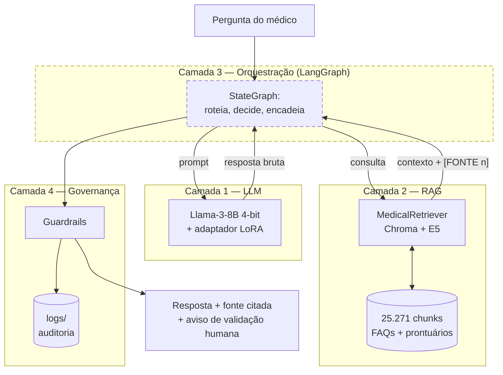

# Tech Challenge 3 — Assistente Médico

Assistente virtual para **profissionais de saúde** (não para o paciente final), construído
sobre um LLM open-source ajustado com fine-tuning, RAG sobre conhecimento clínico e
prontuários, e uma camada de governança que audita e limita as respostas.

Pós-Tech FIAP — IA para Devs | Fase 3 | Arquitetura modular em 4 camadas.

Este documento é ao mesmo tempo o **manual de execução** e o **relatório técnico** do
projeto. Números apresentados aqui foram medidos nesta base de código, e cada um indica o
comando que o reproduz.

---

## Sumário

1. [O projeto e o estado atual](#1-o-projeto-e-o-estado-atual)
2. [Instalação e ambiente](#2-instalação-e-ambiente)
3. [Guia rápido de execução](#3-guia-rápido-de-execução)
4. [Camada 1: fine-tuning da LLM (Integrante 1)](#4-camada-1-fine-tuning-da-llm-integrante-1)
5. [Camada 2: RAG e base vetorial (Integrante 2)](#5-camada-2-rag-e-base-vetorial-integrante-2)
6. [Camada 3: orquestração LangGraph (Integrante 3)](#6-camada-3-orquestração-langgraph-integrante-3)
7. [Camada 4: governança e auditoria (Integrante 4)](#7-camada-4-governança-e-auditoria-integrante-4)
8. [Divisão de trabalho e status](#8-divisão-de-trabalho-e-status)
9. [Limitações conhecidas](#9-limitações-conhecidas)
10. [Estrutura do repositório](#10-estrutura-do-repositório)

---

## 1. O projeto e o estado atual

O fluxo pretendido, ponta a ponta:



**A camada 3 está tracejada porque ainda não existe.** Hoje as camadas 1, 2 e 4 funcionam
isoladamente e não há nada que as encadeie numa execução só.

### Status por camada

| Camada | Responsável | Situação | Onde está |
|---|---|---|---|
| 1. Fine-tuning da LLM | Integrante 1 (Lucas) | **Completa** | `notebooks/`, `src/inferencia.py`, `data/`, `scripts/export_medquad_dataset.py` |
| 2. RAG e base vetorial | Integrante 2 | **Completa** | `src/rag/`, `scripts/build_vector_store.py`, `scripts/query_retriever.py`, `scripts/avaliar_retriever.py`, `tests/` |
| 3. Orquestração LangGraph | Integrante 3 | **Não iniciada** | — (`langgraph` nem consta no `requirements.txt`) |
| 4. Governança e entrega | Integrante 4 | **Parcial** | `src/governance/`, `src/logging/` |

Detalhamento do que falta em cada uma: [§8](#8-divisão-de-trabalho-e-status).

---

## 2. Instalação e ambiente

**Requisitos:** Python 3.14 e GPU NVIDIA com CUDA 12.8. As dependências incluem builds
`+cu128` do PyTorch e não há caminho de fallback para CPU no código de geração.

```powershell
# 1. ambiente virtual
& "$env:LOCALAPPDATA\Python\pythoncore-3.14-64\python.exe" -m venv .venv
.venv\Scripts\activate

# 2. dependências (o --extra-index-url é obrigatório)
pip install -r requirements.txt --extra-index-url https://download.pytorch.org/whl/cu128

# 3. conferir as duas pilhas
.venv\Scripts\python.exe scripts\verificar_ambiente.py
```

Sem o `--extra-index-url`, o pip falha com
`Could not find a version that satisfies the requirement torch==2.11.0+cu128` — os wheels
`+cu128` não existem no PyPI público.

### Por que um único ambiente

O `requirements.txt` é **único** e cobre as duas pilhas: fine-tuning/geração (`unsloth`,
`transformers`, `peft`, `trl`) e recuperação (`langchain`, `chromadb`,
`sentence-transformers`). Elas precisam conviver no mesmo processo, porque o nó gerador da
camada 3 chama o retriever e a LLM na mesma execução.

Durante o desenvolvimento houve dois venvs separados. A conciliação que permitiu unificar:

| Pacote | Exige de `transformers` |
|---|---|
| `unsloth 2026.8.4` | `>=4.51.3, <=5.5.0` |
| `sentence-transformers 6.0.0` | `>=5.0.0, <6.0.0` |

A interseção contém **5.5.0**, que já era o pin da camada 1. O ambiente separado só existia
porque, sem o `unsloth` presente para impor o teto, o pip subia o `transformers` para
5.15.1. Verificado nesta máquina, não apenas resolvido pelo pip: o unsloth importa, aplica
seus patches no `transformers 5.5.0` e inicializa a GPU normalmente em 3.14.7, com os 67
testes passando no mesmo ambiente.

### Nota sobre VRAM

O Llama-3-8B em 4-bit ocupa **~5,5 GB só de pesos**. Em GPUs com menos de ~6 GB o
carregamento falha com `Some modules are dispatched on the CPU or the disk` — é limite de
hardware, não de configuração, e a mensagem não menciona memória.

A camada de RAG roda sem problema em GPUs menores, e até em CPU (mais devagar). **Só a
geração exige a placa maior.** Por isso vários comandos abaixo têm um modo que dispensa a
LLM: `verificar_ambiente.py --pular-llm` e `spike_rag_geracao.py --so-prompt`.

---

## 3. Guia rápido de execução

| Comando | O que faz | Precisa de |
|---|---|---|
| `scripts\verificar_ambiente.py` | Testa as duas pilhas e diz qual falhou | — |
| `scripts\verificar_ambiente.py --pular-llm` | Só a pilha de RAG | — |
| `notebooks\Techchallenge3_executado_final.ipynb` | Treina o adaptador LoRA | **Google Colab** |
| `scripts\export_medquad_dataset.py` | Regenera os datasets em `data/` | rede |
| `scripts\build_vector_store.py` | Constrói a base vetorial (~4 min) | GPU pequena ou CPU |
| `scripts\query_retriever.py "<pergunta>"` | Consulta o retriever | base vetorial |
| `scripts\avaliar_retriever.py` | Recall@k / MRR das 3 estratégias | base vetorial |
| `python -m pytest tests\ -q` | 67 testes | — |
| `scripts\spike_rag_geracao.py --so-prompt` | Valida o orçamento de tokens | base vetorial |
| `scripts\spike_rag_geracao.py --comparar` | RAG + LLM ponta a ponta, com e sem LoRA | GPU ~6 GB + adaptador |
| `src\inferencia.py` | Inferência crua com o adaptador | GPU ~6 GB + adaptador |
| `python -m src.governance.inferencia_segura` | Inferência com guardrails e log | GPU ~6 GB + adaptador |

Todos precedidos de `.venv\Scripts\python.exe`. Ordem sugerida numa máquina nova:
`verificar_ambiente.py` → `build_vector_store.py` → `pytest` → `spike_rag_geracao.py --so-prompt`.

---

## 4. Camada 1: fine-tuning da LLM (Integrante 1)

### 4.1 Como executar — o notebook roda no Google Colab

`notebooks/Techchallenge3_executado_final.ipynb` **não roda localmente como está**: monta o
Google Drive, usa `!pip install` e assume `cuda`. É ele que produz o artefato consumido por
todas as outras camadas.

1. Abrir o notebook no Google Colab, com runtime de GPU.
2. Executar as células na ordem. A primeira monta o Drive e instala `unsloth`, `trl`,
   `peft`, `accelerate`, `bitsandbytes`.
3. Ao final, o adaptador é salvo em
   `/content/drive/MyDrive/TechChallenge3/adaptador_medquad_lora_final`.
4. Compactar essa pasta e baixá-la.

O adaptador já treinado está disponível para download direto:

**[Baixar adaptador_medquad_lora_final.zip](https://drive.google.com/file/d/1Zf67WsQ4_4UAsq93_5KPJmTLr8y8qx1L/view?usp=sharing)**

Extrair de modo que o caminho final seja `artifacts/adaptador_medquad_lora_final/`. Esse
diretório é **gitignored** — nunca estará num checkout limpo, e é pré-requisito de
`src/inferencia.py`, `src/governance/inferencia_segura.py` e do spike da camada 3.

### 4.2 O que foi treinado

| | |
|---|---|
| Modelo base | `unsloth/llama-3-8b-Instruct-bnb-4bit` (Llama-3 8B Instruct pré-quantizado em 4 bits) |
| Técnica | QLoRA — base congelada em 4 bits, só o adaptador treina |
| Dataset | `mukulb/clustered_MEDQUAD_dataset_with_groups` (MedQuAD, Q&A médico do NIH) |
| Amostras | 1.001 (as 1.000 primeiras linhas + a linha 11718) |
| LoRA | `r=16`, `alpha=16`, `dropout=0`, `bias="none"` |
| Módulos alvo | `q,k,v,o_proj` + `gate,up,down_proj` (atenção **e** MLP) |
| Treino | 1 época, batch 2 × grad accum 4 = 8 efetivo → **~125 passos** |
| Otimização | `lr=2e-4`, scheduler linear, warmup 5, `adamw_8bit`, `weight_decay=0.01`, `seed=42` |
| Janela | `max_seq_length=2048` |

**A linha 11718 merece nota.** O dataset é ordenado por tópico, então as 1.000 primeiras são
quase toda oncologia. A linha 11718 é exatamente `"What is (are) Chest Pain ?"` — a pergunta
usada no exemplo de demonstração do notebook e de `src/inferencia.py`. Foi incluída à mão
para o demo ter o que responder; é um caso plantado, não um teste cego.

### 4.3 Template de prompt

Formato Alpaca, com a `instruction` constante nas 1.001 amostras:

```
 abaixo está uma instrução que descreve uma tarefa, juntamente com uma entrada que fornece contexto adicional. Escreva uma resposta que complete adequadamente o pedido.

### Instrução:
Responda à pergunta médica com base em informações clínicas confiáveis.
## Segurança e governança (Parte 4)

Sobre a inferência do modelo, existe uma camada de guardrails e logging que
filtra respostas com indícios de dosagem/prescrição direta, anexa um aviso
padrão de caráter informativo e registra cada interação em log para
auditoria. Essa camada está implementada em [`src/governance/`](src/governance/README.md)
(com apoio de `src/logging/`) — veja o README daquela pasta para detalhes.

Para rodar a versão da inferência com guardrails (recomendada) em vez da
inferência crua:

```powershell
.venv\Scripts\python.exe -m src.governance.inferencia_segura
```

## Executando a inferência local

### Entrada:
{pergunta}

### Resposta:
{resposta}
```

Template em **pt-BR** com conteúdo em **inglês** (o MedQuAD é inglês). O enunciado permite
treinar em qualquer um dos dois desde que justificado; modelos open-source rendem mais em
inglês pelo volume de dados de treino.

> **Atenção de manutenção:** este template está duplicado em 4 lugares — o notebook,
> `src/inferencia.py:25`, `src/governance/inferencia_segura.py:15` e
> `scripts/spike_rag_geracao.py`. Um espaço a mais degrada o adaptador **sem levantar erro
> nenhum**. É a falha mais silenciosa do projeto e o argumento para extrair um módulo único
> de prompt quando a camada 3 for escrita.

### 4.4 Os datasets em `data/`

Gerados por `scripts/export_medquad_dataset.py`, que reproduz exatamente a seleção do
notebook.

| Arquivo | Conteúdo |
|---|---|
| `medquad_raw.jsonl` | as 1.001 linhas de treino, colunas originais |
| `medquad_processed.jsonl` | as mesmas já em `instruction`/`input`/`output` |
| `medquad_rag_pool.jsonl` | as 15.272 linhas restantes, sem sobreposição com o treino |
| `prontuarios_sinteticos.jsonl` | 30 registros clínicos fictícios ([§5.4](#54-prontuários-sintéticos)) |

**Separação treino/RAG, e por que ela não é trivial.** As 1.001 linhas de treino não podem
virar corpus nem gabarito do retriever: o modelo acertaria por memorização e as métricas de
Recall@k/MRR inflariam artificialmente.

Excluir só os índices de treino **não bastava**. O dataset repete a mesma pergunta em
índices diferentes, com respostas de instituições distintas — 57 perguntas de treino
reapareciam em outras **134 linhas**. O `medquad_rag_pool.jsonl` exclui por comparação do
texto da pergunta, não por índice. Quem expandir o corpus por outro caminho precisa refazer
essa checagem.

### 4.5 Inferência local

```powershell
.venv\Scripts\python.exe src\inferencia.py
```

Carrega base + adaptador via Unsloth em 4 bits e responde uma pergunta fixa, sem RAG e sem
guardrails. É o caminho mais cru; para uso real prefira
[§7](#7-camada-4-governança-e-auditoria-integrante-4).

### 4.6 Limitações desta camada

- **Não há avaliação.** Sem split de validação, sem eval loss, sem métrica. Os outputs do
  notebook foram limpos antes do commit, então nem a curva de training loss está
  disponível. A única evidência de que funcionou é a resposta qualitativa do exemplo final.
- **125 passos sobre 1.001 exemplos ensinam formato, não conhecimento.** Um fine-tune desse
  porte alinha o modelo ao estilo de resposta do MedQuAD; o conteúdo clínico continua vindo
  do que o Llama-3 já sabia. Isso **reforça** a necessidade do RAG: é a camada 2 que traz
  fato verificável e fonte citável, não o adaptador.
- **O adaptador foi treinado para responder de memória.** `input` = pergunta crua, `output`
  = resposta. Ele nunca viu evidência recuperada no campo de entrada. Consequências e
  medição em [§6.3](#63-o-spike-de-integração).

---

## 5. Camada 2: RAG e base vetorial (Integrante 2)

Ingestão, indexação e busca semântica. Esta camada **não** carrega o adaptador LoRA, **não**
monta o grafo de decisão e **não** aplica guardrails. Ela entrega evidência rastreável; o
que se faz com ela é decisão das camadas acima.

### 5.1 Como executar

```powershell
# construir a base (~4 min numa MX570); idempotente, pode rodar de novo
.venv\Scripts\python.exe scripts\build_vector_store.py

# variações úteis
.venv\Scripts\python.exe scripts\build_vector_store.py --recriar        # do zero
.venv\Scripts\python.exe scripts\build_vector_store.py --limite 500     # fatia de dev
.venv\Scripts\python.exe scripts\build_vector_store.py --sem-prontuarios

# consultar
.venv\Scripts\python.exe scripts\query_retriever.py "What causes hypothyroidism?"
.venv\Scripts\python.exe scripts\query_retriever.py "..." --modo hibrido --k 6
.venv\Scripts\python.exe scripts\query_retriever.py "exames pendentes" --filtro patient_id=PAC-0007

# avaliação e testes
.venv\Scripts\python.exe scripts\avaliar_retriever.py
.venv\Scripts\python.exe -m pytest tests\ -q
```

Rodar `build_vector_store.py` duas vezes seguidas é seguro: os IDs derivam do conteúdo,
então a segunda execução é um *upsert* sobre os mesmos registros e a contagem não muda.

O diretório `vectorstore/` **não é versionado** (278 MB) — é reconstruível pelo comando
acima. O `data/manifest.json` registra checksum de cada fonte, configuração e data que
geraram o índice, para que se possa auditar meses depois contra qual versão da base uma
resposta foi produzida.

Os 67 testes cobrem determinismo dos IDs, validação de metadados, chunking, idempotência,
persistência entre processos, filtros, abstenção, orçamento de contexto, recorte por
paciente e varredura de PII. Usam embeddings falsos: **não baixam modelo, não exigem GPU e
não acessam a rede.** Qualidade semântica não é testada aí — é medida por
`avaliar_retriever.py`, que é outra coisa e roda separado.

### 5.2 O corpus: duas fontes no mesmo índice

| | MedQuAD (pool) | Prontuários sintéticos |
|---|---|---|
| Documentos | 15.176 | 30 |
| Chunks no índice | 25.241 | 30 (nenhum precisou dividir) |
| `document_type` | `faq_medica` | `prontuario_sintetico` |
| `language` | `en` | `pt-BR` |
| `is_synthetic` | `false` | `true` |
| `patient_id` | `nao_aplicavel` | `PAC-0001` … `PAC-0030` |
| `source_group` | subconjunto do MedQuAD | especialidade (`cardiologia`, …) |
| Cabeçalho do chunk | `Question: … / Answer:` | `Prontuário PAC-NNNN — …` |

Modelo de embedding: `intfloat/multilingual-e5-base`, em Chroma persistente. Total de
**25.271 chunks**.

O cabeçalho muda de propósito. Ele é lido pelo modelo de embedding *e* acaba no prompt da
LLM; rotular um prontuário como `Question:/Answer:` ensinaria os dois a tratá-lo como FAQ, e
o risco concreto é a LLM responder sobre o paciente errado por analogia com uma pergunta
genérica parecida.

### 5.3 Contrato de metadados

Definido em `src/rag/schemas.py`. Todos os campos são escalares e não-nulos, por exigência
do Chroma.

| Campo | Exemplo | Para quê |
|---|---|---|
| `chunk_id` | `medquad-a57...-c000` | identificador estável do trecho |
| `document_id` | `medquad-a57...` | liga o trecho ao documento |
| `source` | `https://rarediseases.info.nih.gov/` | citação |
| `title` | `What are the symptoms of ... ?` | citação legível |
| `document_type` | `faq_medica` | filtro |
| `page_or_section` | `resposta parte 2/3` | localizar a evidência |
| `language` | `en` | filtro |
| `version` / `updated_at` | `medquad-pool-v1` / `2026-08-22` | atualidade |
| `is_synthetic` | `false` | distinguir dado real de fabricado |
| `checksum` | sha256 da resposta | detectar mudança da fonte |
| `source_group` | `2_GARD_QA` | filtro por subconjunto |
| `institution` | `Genetic and Rare Diseases Information Center (NIH/NCATS)` | citação |
| `patient_id` | `PAC-0007` / `nao_aplicavel` | recorte por paciente |

O `source` aponta para a **instituição de origem** (NIH, CDC, NIDDK…), não para o arquivo
JSONL local. O MedQuAD é uma coletânea de conteúdo publicado por essas instituições, e
`schemas.FONTES_MEDQUAD` faz esse mapeamento — é o que permite citar algo verificável.

Num prontuário sintético não há instituição pública para citar, e inventar uma URL seria
pior do que não ter: a citação apontaria para um endereço que não sustenta o que foi dito.
Esses chunks usam `prontuario-sintetico://PAC-0007`, deliberadamente não navegável, para que
quem lê a citação veja de imediato que a evidência é interna e fabricada.

### 5.4 Prontuários sintéticos

Cobrem o requisito do enunciado de consultar "base de dados estruturadas (como prontuários e
registros)" e "contextualizar as respostas da LLM com informações atualizadas do paciente".
O MedQuAD sozinho não atende: é FAQ pública, não tem paciente.

São 30 registros em `data/prontuarios_sinteticos.jsonl`, um por paciente, em pt-BR, com
seções fixas: identificação, motivo, história, comorbidades, medicações em uso, alergias,
exames recentes, **exames pendentes** e avaliação/plano.

A seção de exames pendentes está nos 30 por decisão de projeto: o fluxo do enunciado
("verificar exames pendentes → sugerir conduta → alertar equipe") precisa de um campo
determinístico sobre o qual ramificar. `tests/test_prontuarios.py` falha se algum registro
perder essa seção.

**Recorte por paciente**, que é o que sustenta a contextualização:

```python
retriever.retrieve("exames pendentes", k=4, filters={"patient_id": "PAC-0007"})
retriever.retrieve("...", k=4, filters={"document_type": "faq_medica"})
```

Sem o recorte, uma pergunta sobre o paciente A traz o registro do paciente B por
similaridade clínica — dois diabéticos descompensados são textos muito parecidos.

#### Anonimização: por construção, não por remoção

Os registros **não têm** nome, CPF, RG, telefone, endereço, e-mail nem data de nascimento. A
identificação é `PAC-NNNN`, mais idade e sexo — o mínimo clinicamente necessário.

Isso é deliberado. Anonimizar removendo dado deixa resíduo e depende de alguém lembrar de
rodar o processo; não gerar o dado não deixa resíduo nenhum. Como efeito colateral,
`tests/test_privacidade.py` passa por construção, sem allowlist.

#### Dosagens: um falso positivo esperado

Os registros listam medicação com posologia real ("metformina 850 mg duas vezes ao dia"),
porque um prontuário sem isso não é um prontuário. Medido: **26 dos 30 (87%)** casam o padrão
de prescrição do guardrail, contra 0,35% das FAQs. Consequências em
[§7.4](#74-o-falso-bloqueio-que-o-rag-introduz).

### 5.5 Interface para a camada 3

```python
from src.rag.retriever import MedicalRetriever

retriever = MedicalRetriever()                      # modo="denso" por padrão
resultados = retriever.retrieve(pergunta, k=4)      # list[ResultadoRecuperacao]

if not retriever.tem_evidencia_suficiente(resultados):
    ...  # responder que não há suporte, em vez de improvisar

contexto = retriever.format_context(
    resultados,
    max_tokens=1200,
    contar_tokens=lambda t: len(tokenizer.encode(t, add_special_tokens=False)),
)
```

| Atributo de `ResultadoRecuperacao` | Significado |
|---|---|
| `.documento` | o `Document` canônico do LangChain |
| `.score` | similaridade de cosseno, 0..1 — maior é melhor |
| `.rank` | posição no ranking, começando em 1 |
| `.texto` / `.metadados` | atalhos para `page_content` / `metadata` |
| `.citacao()` | `título — instituição (url)`, pronto para exibir |

`recuperar_documentos()` devolve `list[Document]` puro, para quem preferir o formato
canônico.

**O score volta junto com o resultado, e isso é deliberado.** A abstenção depende dele e é
decidida pela camada 4. Se o score saísse por outra porta, ou a decisão migraria para a
camada errada, ou cada consumidor reimplementaria a sua e elas divergiriam.

**Filtros disponíveis:** `document_type`, `language`, `source_group`, `is_synthetic`,
`version`, `patient_id`. Valor único faz igualdade; lista faz "está em".

**Cuidado de performance:** instancie o `MedicalRetriever` **uma vez**. Nos modos `hibrido`
ou `bm25` a construção carrega e tokeniza os 25.271 chunks para montar o índice lexical.

### 5.6 Decisões de projeto e o que as sustenta

#### O chunk é o par Q&A, não 600 caracteres

O guia sugeria `RecursiveCharacterTextSplitter` com 600/80. É um bom default para prosa em
PDF, mas o corpus são pares pergunta/resposta atômicos. Medido:

| | Guia (600/80) | Implementado (Q&A, 1.200) |
|---|---|---|
| Chunks | 39.985 | **25.241** (−37%) |
| Documentos não divididos | — | 9.488 de 15.176 (62,5%) |
| Pergunta presente em todo trecho | não | sim |
| Contexto com k=4 | ~502 tokens (subutiliza) | **~1.000 tokens** |

Com 600/80, a partir do segundo pedaço o trecho perde a pergunta que lhe dá sentido — inútil
para o retriever e péssimo como evidência citada. Aqui a pergunta é repetida no cabeçalho de
cada parte.

#### O orçamento de contexto depende do idioma

O limite de 1.200 caracteres saiu de medição: com o tokenizer real do modelo, o MedQuAD tem
**4,58 caracteres por token**, então 1.200 chars ≈ 262 tokens, e `k=4` monta ~1.000 tokens —
dentro do que o orçamento permite (2.048 de janela − 250 de geração − ~90 de template).

**Mas a razão muda com o idioma.** Os prontuários em pt-BR dão **3,00 chars/token** com o
mesmo tokenizer: o do Llama-3 é majoritariamente inglês e fragmenta mais o português.

| corpus | chars/token |
|---|---|
| MedQuAD (en) | 4,58 |
| Prontuários (pt-BR) | **3,00** |

A constante única de 4,78 que existia antes subestimava o custo do pt-BR em ~60%: `k=4`
prontuários somam ~1.599 tokens reais e a estimativa dizia 1.004. Isso cabia no orçamento
declarado e estourava a janela de verdade — e o corte acontece **dentro** da LLM, em
silêncio, levando embora o final do contexto, que é onde mora a conclusão. Corrigido em
`retriever.py` (`CHARS_POR_TOKEN_POR_IDIOMA`), com fallback no valor mais conservador.

Ainda assim: no prompt final, **passe o tokenizer real**. A estimativa serve para planejar,
não para garantir.

#### fp16 nos embeddings

Medido: **25,6 → 149,9 chunks/s (5,9x)**, com similaridade de cosseno mínima de 0,99999
contra fp32 numa amostra de 50 chunks. Derruba a ingestão completa de ~18 min para ~4 min.
Ativado automaticamente em GPU e desligado em CPU, onde meia precisão é emulada e fica mais
lenta.

#### Coleção em espaço de cosseno

O padrão do Chroma é distância L2. Com embeddings normalizados o *ranking* é idêntico, mas o
*valor* do score só é interpretável em cosseno — e precisamos interpretá-lo para calibrar a
abstenção.

### 5.7 Avaliação de recuperação

200 sondas parafraseadas + 30 perguntas sem suporte no corpus. Reproduzir com
`scripts/avaliar_retriever.py`; resultados brutos em `data/avaliacao_retriever.json`.

| modo | R@1 | R@3 | **R@5** | R@10 | MRR | ms/consulta |
|---|---|---|---|---|---|---|
| **denso** | **0,755** | **0,960** | **0,980** | **0,980** | **0,853** | **31** |
| bm25 | 0,230 | 0,530 | 0,680 | 0,785 | 0,404 | 413 |
| híbrido (RRF) | 0,490 | 0,825 | 0,910 | 0,955 | 0,663 | 461 |

R@5 = 0,980 supera a meta sugerida pelo guia (≥ 0,80).

#### Como o conjunto de avaliação é montado

O `query` de cada linha do MedQuAD é, por construção, uma pergunta correta para aquela
resposta — o gabarito sai de graça. Duas armadilhas foram tratadas:

- **Usar o `query` original mediria casamento lexical.** As perguntas são templatizadas (89%
  em 12 padrões), então são parafraseadas de forma determinística: *"What causes X ?"* vira
  *"What is the etiology of X?"*. O nome da condição permanece como âncora — realista, já
  que o médico digita o nome da doença — mas nenhuma outra palavra de conteúdo é
  compartilhada com o texto indexado.
- **Cobrar o `document_id` exato puniria acertos legítimos.** O dataset repete a mesma
  pergunta respondida por instituições diferentes. Cada caso carrega o *conjunto* de IDs
  aceitos, agrupado por pergunta normalizada.

#### A hipótese da busca híbrida foi refutada

A expectativa era que o BM25 ajudasse em entidade rara e que o híbrido batesse o denso. **O
oposto aconteceu:** o denso vence em toda métrica, é 13x mais rápido, e o híbrido fica pior
que o denso puro — a fusão RRF com pesos iguais deixa um ranqueador fraco arrastar um forte.

O motivo provável é que as paráfrases preservam o nome da condição, e o E5 lida bem com
substantivo próprio: o denso já tinha a âncora de entidade que se supunha exclusiva do BM25.

Ressalva na direção oposta: **este BM25 é fraco** — tokenização por `split()`, sem stemming,
sem stopwords. O que os dados sustentam é "este BM25 não ajuda", não "busca lexical é
inútil". Os modos seguem implementados para quem quiser retomar a comparação.

#### Abstenção: resultado negativo

`tem_evidencia_suficiente()` compara o score do topo-1 com `LIMIAR_EVIDENCIA = 0.73`. **É uma
heurística fraca, e isso foi medido, não suposto.**

As distribuições de score de perguntas cobertas e não cobertas **se sobrepõem**: positivos
têm p05 = 0,718, negativos chegam a 0,726. Não há corte limpo. Sinais alternativos são
piores — o gap entre topo-1 e topo-5 separa ao contrário, porque numa pergunta legítima há
vários chunks quase igualmente bons e o topo-1 não se destaca.

O 0,73 é escolha de **assimetria de custo**, não separação:

| limiar | abstenção falsa | negativo aceito |
|---|---|---|
| 0,710 | 3,5% | 6,7% |
| **0,730** | **9,0%** | **0,0% (0 de 30)** |
| 0,750 | 17,0% | 0,0% |

Os 0,0% valem para 30 negativos: com n=30, o limite superior do intervalo de confiança fica
perto de 10%. **É um sinal de baixa confiança, não uma garantia.**

> **Não use `tem_evidencia_suficiente()` no caminho do paciente.** Medido em 90 consultas
> (30 pacientes × 3 perguntas) com filtro por `patient_id`: o paciente correto foi recuperado
> em **90/90 (100%)**, e o limiar de 0,73 rejeitaria **90/90 (100%)** — scores entre 0,619 e
> 0,715. A recuperação é perfeita e a heurística reprovaria todas. A causa é estrutural: o
> 0,73 foi calibrado com perguntas em inglês contra FAQs em inglês; aqui são gêneros
> textuais diferentes (pergunta curta vs. registro clínico estruturado) e o cosseno cai.
> Quando o filtro por `patient_id` devolve algo, é o prontuário certo **por construção** — o
> filtro já é a garantia. Travado por regressão em `tests/test_prontuarios.py`.

### 5.8 Achados sobre os dados

- **47 linhas são duplicatas exatas** (mesma pergunta *e* mesma resposta), sobretudo
  registros do NIDDK repetidos de 2 a 4 vezes. Removidas na carga: indexá-las colocaria
  chunks idênticos disputando o mesmo top-k. Verificado que são duplicatas reais, não
  colisão de hash.
- **49 respostas têm menos de 40 caracteres** (a menor tem 6). Descartadas — não são
  evidência utilizável e só poluem o topo-k.
- **O corpus contém 8 endereços de e-mail**, todos institucionais e baseados em função
  (`2020@nei.nih.gov`, `adear@nia.nih.gov`, `atainfo@ataccess.org`…), publicados pelas
  próprias instituições. Não são dado pessoal e não são nossos para remover. Estão numa
  allowlist revisada em `tests/test_privacidade.py`, de modo que qualquer endereço **novo**
  faz o teste falhar e passa por revisão humana.

### 5.9 Antônimos clínicos: o risco medido mais sério desta camada

O par hipo/hiper é quase idêntico em espaço de embedding e **clinicamente oposto**. Medido
com a consulta *"What are the treatments for hypothyroidism?"*:

| rank | score | documento |
|---|---|---|
| 1 | 0,7942 | What are the treatments for **Hyper**thyroidism ? |
| 2 | 0,7769 | What are the treatments for **Hypo**thyroidism ? |
| 3 | 0,7733 | What are the treatments for Graves' Disease |
| 5 | 0,7658 | What are the treatments for Hashimoto's Disease |

O documento correto **existe no corpus** e é recuperado — mas em segundo lugar, atrás da
condição oposta, por uma margem de 0,017. No top-8, 5 dos 8 trechos tratam da condição
oposta à perguntada.

Em 6 sondas de antônimos (hipo/hiper tireoidismo, glicemia, tensão), o top-1 foi a condição
oposta em **1 de 6**, e o top-4 continha a condição oposta em **2 de 6**. Não é um defeito
uniforme; é um modo de falha que existe e que o score **não sinaliza** — 0,79 é alto, bem
acima do limiar de abstenção.

**Consequência para as camadas de cima:** a abstenção por score não protege contra este
caso, porque o score é alto e a recuperação é "boa" no sentido semântico. O que protege é a
**citação**: se a resposta precisa apontar qual `[FONTE n]` usou, um humano auditando vê
imediatamente que o assistente citou o tratamento de hipertireoidismo para uma pergunta
sobre hipotireoidismo. É mais um argumento para o guardrail de citação
([§7.5](#75-o-que-falta-nesta-camada)) e para não usar `k=1` no caminho de FAQ.

---

## 6. Camada 3: orquestração LangGraph (Integrante 3)

**Status: não iniciada.** Não existe `StateGraph`, não existe nó de decisão, e `langgraph`
não consta do `requirements.txt`. É a peça que falta para o sistema existir como um
assistente, em vez de três componentes que funcionam isoladamente.

### 6.1 O que precisa ser construído

Conforme a divisão oficial de tarefas:

- Modelagem do assistente como grafo direcionado (`StateGraph`) no LangGraph.
- Nós funcionais para os fluxos automatizados: verificação de exames pendentes, sugestão de
  conduta, alerta para a equipe médica.
- **Integração de componentes:** conexão da LLM customizada (camada 1) com o motor RAG
  (camada 2) dentro das cadeias orquestradas.
- Definição tipada de estado (`State`) e diagrama do fluxo de decisão.

### 6.2 O contrato já disponível para consumir

O nó de recuperação, na prática:

```python
def no_recuperacao(estado: EstadoClinico) -> EstadoClinico:
    resultados = retriever.retrieve(estado.pergunta, k=4)

    if not retriever.tem_evidencia_suficiente(resultados):
        return estado.model_copy(update={
            "contexto": "", "evidencia_suficiente": False, "fontes": [],
        })

    return estado.model_copy(update={
        "contexto": retriever.format_context(resultados, max_tokens=1200),
        "evidencia_suficiente": True,
        "fontes": [r.citacao() for r in resultados],
    })
```

O ramo de `evidencia_suficiente == False` deve levar a uma resposta de insuficiência de
contexto, **não** à geração livre — é o requisito explícito de não improvisar sem suporte. E
é o guardrail mais barato do sistema: se não há evidência, a LLM nem é chamada.

**Recomendação: duas recuperações separadas, não uma.** Um `retrieve` sem filtro sobre
"conduta para o diabetes descompensado do PAC-0002" mistura os dois corpora num top-k só, e
quem decide a proporção é a similaridade, não o que a resposta precisa. Buscar o prontuário
do paciente e a FAQ da condição em chamadas distintas, e concatenar os contextos, dá
controle sobre quanto de cada coisa entra no prompt.

Contrato completo em [§5.5](#55-interface-para-a-camada-3). Ressalva importante sobre
abstenção no caminho do paciente em [§5.7](#57-avaliação-de-recuperação).

### 6.3 O spike de integração

`scripts/spike_rag_geracao.py` liga recuperação, prompt, adaptador e guardrail num processo
só. **Não é o nó do LangGraph** — não tem grafo, estado nem roteamento. Existe para medir
três hipóteses que sustentam o desenho das camadas 2 e 4 e que nunca tinham sido exercidas
juntas.

```powershell
# valida o orçamento de tokens; não carrega a LLM, roda sem GPU
.venv\Scripts\python.exe scripts\spike_rag_geracao.py --so-prompt

# ponta a ponta, com o A/B que importa (exige GPU ~6 GB ou Colab)
.venv\Scripts\python.exe scripts\spike_rag_geracao.py --comparar

# contextualização por paciente
.venv\Scripts\python.exe scripts\spike_rag_geracao.py --paciente PAC-0007 --so-prompt
```

**1. O contexto cabe** — validado. Números reais do `--so-prompt`:

| cenário | contexto | prompt total | folga (teto 1.798) |
|---|---|---|---|
| `k=4`, FAQ em inglês | 999 | 1.123 | 675 |
| `k=1`, prontuário pt-BR | 417 | 546 | 1.252 |

**2. O adaptador usa o contexto, ou o ignora** — a medir numa GPU maior. O LoRA foi treinado
com `input` = pergunta crua e `output` = resposta, isto é, para responder **de memória** — o
oposto do que o RAG quer. Contexto no campo `Entrada` é fora da distribuição de treino dele.
O `--comparar` gera duas vezes sob o mesmo prompt, com e sem o LoRA (via `disable_adapter` do
PEFT, sem recarregar o modelo base), e compara a ancoragem lexical de cada resposta no
contexto. **Se o modelo base for mais fiel ao contexto que o ajustado, isso é um achado do
projeto, não um defeito** — é evidência de que RAG e fine-tuning resolvem problemas
diferentes.

**3. A citação sobrevive** — a medir. O guardrail de citação recomendado à camada 4 exige que
a resposta referencie uma `[FONTE n]` recuperada; só funciona se o marcador chegar à saída.

**Consequência prática, qualquer que seja o resultado:** a instrução de RAG provavelmente não
pode ser a de treino. Nas 1.001 amostras a `instruction` era constante, então o modelo teve
pouco sinal para tratá-la como comando. O spike usa uma instrução explícita ("use somente as
fontes fornecidas, cite [FONTE n]") e mede se ela pega.

---

## 7. Camada 4: governança e auditoria (Integrante 4)

### 7.1 Como executar

```powershell
.venv\Scripts\python.exe -m src.governance.inferencia_segura
```

Ponto de entrada recomendado para demo, em vez de `src/inferencia.py`: adiciona a camada de
segurança e o log de auditoria.

### 7.2 Guardrails

`src/governance/guardrails.py`:

- `contem_prescricao_direta(texto)` — detecta, por regex, indícios de dosagem/prescrição
  (`"500 mg"`, `"dose ... 10"`, `"tome 2"`, `"take 3"`, `"administre 5"`).
- `aplicar_guardrail(resposta)` — se detectar, **bloqueia** e substitui por uma recusa
  padrão; caso contrário anexa o `AVISO_PADRAO` de que o conteúdo é informativo e não
  substitui avaliação profissional. Retorna `{"resposta_final": str, "bloqueado": bool}`.

`src/governance/inferencia_segura.py` encadeia carregamento do modelo (em cache),
montagem do prompt, geração, guardrail e log, devolvendo só a resposta final.

### 7.3 Logging e explainability

`src/logging/logger.py` grava `logs/interacoes.jsonl` com timestamp, pergunta, resposta
bruta, resposta final e se houve bloqueio.

Do lado do RAG, a **explainability já está resolvida na origem**: todo chunk carrega
`source`, `title`, `institution` e `page_or_section`, e o `source` aponta para a instituição
de origem, não para o arquivo local — então a citação é verificável. `format_context()`
preserva os marcadores `[FONTE n]` em correspondência com os metadados.

### 7.4 O falso bloqueio que o RAG introduz

O guardrail bloqueia qualquer resposta que case `\d+\s*(mg|ml|mcg|g|iu|units?)`. Isso era
razoável quando o modelo respondia de memória e raramente citava número. Com RAG no caminho,
muda:

| corpus | documentos que disparam o padrão |
|---|---|
| FAQs do MedQuAD (n=2.000) | 7 (0,35%) |
| Prontuários sintéticos (n=30) | **26 (87%)** |

O risco não vem das FAQs, como se poderia supor: vem dos prontuários, que listam medicação
com posologia. **Praticamente todo caminho de paciente cai no guardrail.** A taxa de bloqueio
sobe justamente quando o sistema fica **mais** correto — reproduzir a fonte não é prescrever.

Sugestão concreta: distinguir os dois casos. Se a dosagem aparece no contexto recuperado, é
citação e deve passar (idealmente com a fonte anexada); se aparece só na saída do modelo e
não no contexto, aí sim é geração de posologia e deve bloquear. O contexto está disponível no
mesmo escopo — é comparação de substring, não classificador.

`spike_rag_geracao.py` reporta o veredito do guardrail em toda geração, então dá para medir a
frequência antes de decidir.

### 7.5 O que falta nesta camada

- **O log não registra a fonte.** `registrar_interacao()` grava pergunta, resposta e
  veredito, mas não os `chunk_id`/`score` recuperados nem a assinatura do índice
  (`data/manifest.json` → `configuracao.assinatura`). É justamente essa assinatura que
  permite afirmar, meses depois, contra qual versão da base uma resposta foi gerada. Sem
  isso, a explainability existe no retriever mas não chega à trilha de auditoria.
- **`inferencia_segura.py` não usa RAG.** Monta o prompt só com a pergunta; o
  `MedicalRetriever` nunca é chamado. Depende da camada 3.
- **Guardrail de citação.** Exigir que a resposta referencie ao menos um `[FONTE n]`
  presente no contexto, e tratar como não-suportada a que não o faça. Pega o caso em que o
  retriever trouxe vizinhos fracos e a LLM preencheu as lacunas — a falha mais perigosa do
  conjunto — e é a única proteção contra o problema de antônimos da [§5.9](#59-antônimos-clínicos-o-risco-medido-mais-sério-desta-camada).
- **Consolidação da entrega:** vídeo de até 15 minutos e relatório técnico.

---

## 8. Divisão de trabalho e status

Divisão oficial, conforme `temp/divisao_tarefas_tech_challenge_fase3.pdf`.

| # | Módulo | Responsável | Entrada | Saída |
|---|---|---|---|---|
| 1 | Fine-tuning e dados | Integrante 1 (Lucas) | Protocolos, FAQs e laudos | Dataset anonimizado + adapters da LLM |
| 2 | RAG e vetores | Integrante 2 | Prontuários e diretrizes clínicas | Vector store + Retriever |
| 3 | Orquestração LangGraph | Integrante 3 | LLM ajustada + Retriever | StateGraph do fluxo clínico |
| 4 | Governança e delivery | Integrante 4 | Grafo completo | Guardrails, logs, repositório e vídeo |

### O que está efetivamente implementado

**Integrante 1 — completo.** Notebook de fine-tuning executado no Colab, adaptador LoRA
disponível para download, dataset exportado e versionado com separação treino/RAG
verificada por texto, script de inferência local.
*Falta:* nenhuma métrica de avaliação do fine-tuning ([§4.6](#46-limitações-desta-camada)).

**Integrante 2 — completo.** Pipeline de ingestão idempotente, 25.271 chunks indexados de
duas fontes, contrato de metadados validado, retriever com 3 modos de busca, filtros
(incluindo recorte por paciente), 30 prontuários sintéticos anonimizados, avaliação com
Recall@k/MRR, 67 testes, manifesto de proveniência com checksum por fonte.
*Fora de escopo por decisão registrada:* avaliação de Recall@k sobre os 30 prontuários (n
pequeno demais para significar algo) e recalibração do limiar de abstenção para pt-BR.

**Integrante 3 — não iniciado.** Ver [§6](#6-camada-3-orquestração-langgraph-integrante-3).
O contrato de consumo está pronto e documentado, e `spike_rag_geracao.py` já valida a
fronteira LLM↔RAG sem construir o grafo.

**Integrante 4 — parcial.** Guardrail de prescrição, aviso padrão e log JSONL de auditoria
funcionam. *Falta:* fonte na trilha de auditoria, guardrail de citação, integração com RAG
(depende da camada 3), vídeo e relatório. Ver [§7.5](#75-o-que-falta-nesta-camada).

---

## 9. Limitações conhecidas

Consolidado de todas as camadas. As que têm medição estão linkadas à seção correspondente.

**Do fine-tuning**

- Sem avaliação quantitativa: nenhuma métrica, nenhum split de validação, outputs do
  notebook limpos antes do commit.
- 125 passos sobre 1.001 exemplos ensinam formato, não conhecimento clínico.
- O adaptador foi treinado para responder de memória, não a partir de contexto recuperado.
- O template de prompt está duplicado em 4 arquivos, com divergência silenciosa possível.

**Da recuperação**

- [Antônimos clínicos](#59-antônimos-clínicos-o-risco-medido-mais-sério-desta-camada): a
  condição oposta pode vencer o top-1 com score alto, e o score não sinaliza.
- [Abstenção por score](#57-avaliação-de-recuperação) é sinal fraco: as distribuições se
  sobrepõem, e o limiar não se aplica ao caminho do paciente.
- Os 30 prontuários não têm métrica de recall — só testes funcionais.
- Índice mistura idiomas: uma pergunta em pt-BR tende a puxar prontuários por afinidade de
  idioma além da de conteúdo. Use `filters` quando quiser garantir um dos dois.
- O BM25 é reconstruído a cada instância do `MedicalRetriever`.
- Recalibrar é obrigatório se o modelo de embedding ou o corpus mudarem.

**Da governança**

- O log de auditoria não registra a fonte recuperada.
- O guardrail bloqueia 87% dos prontuários por reproduzirem posologia da fonte.

**Do sistema como um todo**

- **Nunca houve uma execução ponta a ponta.** O `verificar_ambiente.py` valida que as duas
  pilhas convivem no mesmo processo, mas em máquina sem VRAM suficiente ele reporta `[AVISO]`
  e devolve sucesso — então um "OK" no resumo **não** significa que a geração funciona ali.
  A integração real depende da camada 3 e de uma GPU com ~6 GB ou do Colab.
- O corpus não contém protocolos internos nem modelos de laudo de um hospital real; o
  enunciado os cita como fonte, e o que existe é MedQuAD (público) mais prontuários
  fabricados.

---

## 10. Estrutura do repositório

```
.
├── data/                                Datasets versionados
│   ├── medquad_raw.jsonl                1.001 linhas de treino, formato original
│   ├── medquad_processed.jsonl          as mesmas em instruction/input/output
│   ├── medquad_rag_pool.jsonl           15.272 linhas restantes, sem overlap com treino
│   ├── prontuarios_sinteticos.jsonl     30 registros clínicos fictícios
│   ├── manifest.json                    proveniência do índice (checksum por fonte)
│   └── avaliacao_retriever.json         resultados brutos da avaliação
├── notebooks/
│   └── Techchallenge3_executado_final.ipynb    fine-tuning — roda no Google Colab
├── scripts/
│   ├── verificar_ambiente.py            checa as duas pilhas separadamente
│   ├── export_medquad_dataset.py        regenera os datasets de data/
│   ├── build_vector_store.py            constrói/atualiza a base vetorial
│   ├── query_retriever.py               consulta pela linha de comando
│   ├── avaliar_retriever.py             Recall@k / MRR das 3 estratégias
│   └── spike_rag_geracao.py             integração RAG + LoRA + guardrail
├── src/
│   ├── inferencia.py                    inferência crua com o adaptador
│   ├── rag/                             CAMADA 2
│   │   ├── schemas.py                   contrato de metadados, IDs, proveniência
│   │   ├── loaders.py                   leitura e validação das fontes
│   │   ├── preprocess.py                chunking e montagem de metadados
│   │   ├── embeddings.py                E5 com prefixos assimétricos
│   │   ├── ingest.py                    indexação idempotente e manifesto
│   │   ├── retriever.py                 busca, abstenção e formatação de contexto
│   │   └── evaluation.py                conjunto de sondas e métricas
│   ├── governance/                      CAMADA 4
│   │   ├── guardrails.py                filtro de prescrição + aviso padrão
│   │   └── inferencia_segura.py         wrapper modelo + guardrail + log
│   └── logging/
│       └── logger.py                    trilha de auditoria em JSONL
├── tests/                               67 testes, sem GPU e sem rede
├── artifacts/                           GITIGNORED — adaptador LoRA (baixar, ver §4.1)
├── vectorstore/                         GITIGNORED — Chroma, 278 MB (reconstruível)
├── logs/                                GITIGNORED — trilha de auditoria
└── requirements.txt                     pilha única (fine-tuning + RAG)
```
